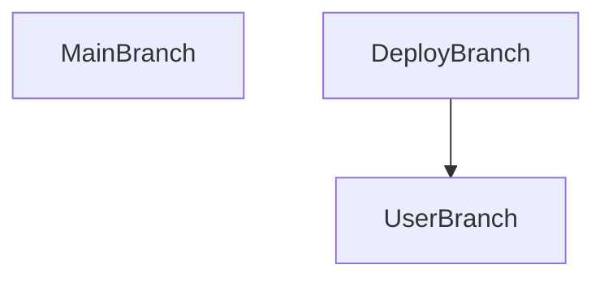

# Ejercicio BootcApp

Empaquetado JAR es para Java <br>
Empaquetado WAR es para Web

[Spring Boot Samples](https://spring.io/projects/spring-boot#samples) <br>
[Spring Boot Initializr](https://start.spring.io/)

### Preparing project
* Java
* Maven
* JDK and Java 21
* Packaging War (for web)

### Dependency, Spring Boot: 3.4.0 (SNAPSHOT)
- Developer Tools:
  * Spring Boot DevTools
  * Lombok
- Web:
  * Spring Web
  * Rest Repositories
  * Spring Web Services
- Template Engines:
  * Thymeleaf
- Security
  * Spring Security
- SQL:
  * Spring Data JPA
  * MySql Driver

### Folder
```
/
├── main/
│   ├── java/
│   │   └── packages/
│   │      ├── configure/
│   │      ├── controllers/
│   │      ├── entities/
│   │      ├── repositories/
│   │      ├── services/
│   │      ├── App.java
│   │      └── ServletInitializer.java
│   └── resources/
│          ├── static/
│          └── templates/
└── test/
```

### Annotations
* Clases
  * @Service
  * @Repository
  * @Controller (WebApp)
  * @RestController (RestAPI)
  * @RequestMapping
* Entities
  * @Entity
  * @Table
  * @Id
  * @GeneratedValue
  * @Column
  * @Transient // el Atributo no se crea en la BD
  * @CreationTimestamp + @Column(updatable = false)
  * @UpdateTimestamp
  * @OneToOne(mappedBy = "atrib_t2", fetch = FetchType.LAZY/EAGER)
  * @OneToOne(fetch = FetchType.LAZY/EAGER)
    * @JoinColumn(name = "id_t1")
  * @OneToMany(mappedBy ="atrib_t2", fetch = FetchType.LAZY/EAGER)
  * @ManyToOne(fetch = FetchType.LAZY/EAGER)
    * @JoinColumn(name = "id_t1")
  * @ManyToMany(fetch = FetchType.LAZY/EAGER)
    * @JoinTable(
        name = "t1_t2",
        joinColumns = @JoinColumn(name = "id_t1"),
        inverseJoinColumns = @JoinColumn(name = "id_t2"))
  * @ManyToMany(mappedBy = "atrib_t2", fetch = FetchType.LAZY/EAGER)
* Metods
  * @Autowired
  * @GetMapping
  * @PostMapping
  * @PutMapping
  * @DeleteMapping
  * @RequestMapping
* Metods Param
  * @RequestAttribute
  * @ModelAttribute
  * @RequestParam

### Config DB
* Edit application.properties file
```
spring.mvc.view.prefix=/templates/

# MySQL Database Configuration
spring.datasource.url=jdbc:mysql://localhost:3306/praxis?useSSL=false&serverTimezone=UTC
spring.datasource.username=praxis
spring.datasource.password=praxis
spring.datasource.driver-class-name=com.mysql.cj.jdbc.Driver
spring.jpa.database-platform=org.hibernate.dialect.MySQLDialect

# Hibernate Configuration
spring.jpa.show-sql=true
spring.jpa.properties.hibernate.format_sql=true
spring.jpa.hibernate.ddl-auto=update
```

### Config MVC
* Edit application.properties file
```
# Enable PUT and DELETE in MVC
spring.mvc.hiddenmethod.filter.enabled=true
```

### Config Error Template
* Edit application.properties file
```
# Custom Error Controller
server.error.whitelabel.enabled=false
server.error.path=/error
```
* Create error404.html
* Create Custom Error Controller
```
@Controller
public class CustomErrorController implements ErrorController {
    @GetMapping("/error")
    public String handleError(HttpServletRequest request) {
        Object status = request.getAttribute(RequestDispatcher.ERROR_STATUS_CODE);

        if (status != null) {
            Integer statusCode = Integer.valueOf(status.toString());

            if (statusCode == 404) {
                return "error404";
            }
        }

        return "error404";
    }
}
```
### Tests
```
//Integra Mockito con JUnit 5.
@ExtendWith(MockitoExtension.class)

//Crea un mock del repositorio.
@Mock
IRepository repository;

//Inyecta los mocks en el servicio.
@InjectMocks
Servicio servicio;

//Configura el Mock (repo) para que devuelva algo (thenReturn)
Algo algo = new Algo(....
when(repository.metodo()).thenReturn(algo);

// Llama al método del servicio para obtener algo
Algo result = service.metodo();

// Verifica que el resultado del método sea igual a algo
assertThat(result).isEqualTo(algo);

// Verifica que el método del repositorio se haya llamado una vez
verify(repository, times(1)).metodo();
```

### Loggers
```
// import org.springframework.boot.CommandLineRunner;
// implements CommandLineRunner 

import org.slf4j.Logger;
import org.slf4j.LoggerFactory;

private final static Logger LOG = LoggerFactory.getLogger(App.class);

@Override
public void run(String... args) throws Exception {
  LOG.info("Se Inicio el Software");
  
  LOG.info("Mensaje Informativo");
  LOG.warn("Mensaje de Advertencia");
  LOG.error("Mensaje de Error");
}
```

### Spring Security
* SecurityConfig Class in /configure folder
```
@Configuration
@EnableWebSecurity
public class SecurityConfig {

    @Bean
    public SecurityFilterChain securityFilterChain(HttpSecurity http) throws Exception {
        http.authorizeRequests(request -> request
                        .requestMatchers("/", "/login", "/register", "/css/**").permitAll()
                        .anyRequest().authenticated()
        ).formLogin(formLogin -> formLogin
                        .loginPage("/login")
                        .defaultSuccessUrl("/demo", true)
                        .permitAll())
                .csrf(csrf -> csrf.disable());

        return http.build();
    }
}
```

### Bootstrap
```
<!-- Bootstrap CSS -->
<link
  href="https://cdn.jsdelivr.net/npm/bootstrap@5.3.3/dist/css/bootstrap.min.css"
  rel="stylesheet"
  integrity="sha384-QWTKZyjpPEjISv5WaRU9OFeRpok6YctnYmDr5pNlyT2bRjXh0JMhjY6hW+ALEwIH"
  crossorigin="anonymous"
>

<!-- Bootstrap Icons -->
<link
  rel="stylesheet"
  href="https://cdn.jsdelivr.net/npm/bootstrap-icons@1.10.5/font/bootstrap-icons.css"
>

<script
  src="https://cdn.jsdelivr.net/npm/bootstrap@5.3.3/dist/js/bootstrap.bundle.min.js"
  integrity="sha384-YvpcrYf0tY3lHB60NNkmXc5s9fDVZLESaAA55NDzOxhy9GkcIdslK1eN7N6jIeHz"
  crossorigin="anonymous">
</script>
```

### TaskKill
```
cmd
netstat -ano
netstat -ano | findstr :8080
taskkill /f /pid <pid-number>
```

### Git
```
git checkout -b branchName                  // crear rama
git checkout main                           // cambiar rama
git pull                                    // descargar las modificaciones de GitHub
git branch                                  // ver todas las ramas
git push --set-upstream origin "branchName" // crea la branch automaticamente en Github
git commit -m "branchName"                  // crear historico commits
git push                                    // actualiza el branch en GitHub

// merge con develop
git branch                // visualiza los brancha
git checkout develop      // cambiar y crear branch develop
git pull origin develop   // descarga brancha develop
git merge branchName      // hace merge del branchName con el branchActual
git status                // visualiza los cambios pendientes
git push origin develop   // envia brancha develop
git checkout branchName   // cambiar y crear branchName
git switch branchName     // cambiar a branchName
git branch -d branchName  // elimina branchName
git rm --cached src/main/resources/application.properties // agrega a git ignore

```

### Proyecto
* Cada requerimiento se trabaja en la rama del Usuario (UserBranch).
* Finalizado el requerimiento se hace Merge con el Deploy (DeployBranch).
* No tocar el Main (MainBranch).


### Seed
* Create data.sql in Resources folder 
* Edit application.properties file
```
// replace this 
spring.jpa.hibernate.ddl-auto=update

// with this
# Seed
spring.jpa.hibernate.ddl-auto=create-drop
spring.jpa.defer-datasource-initialization=true
spring.sql.init.mode=always
```

### MySQL Query
```
INSERT INTO roles
    (nombre)
VALUES
    ('Admin'),
    ('Profesor'),
    ('Estudiante'),
    ('Apoderado');

INSERT INTO cursos
    (nombre)
VALUES
    ('Full Stack Java'),
    ('Full Stack JavaStript'),
    ('Full Stack .NET'),
    ('Python'),
    ('TypeScript');

INSERT INTO asignaturas
    (nombre, id_curso)
VALUES
    ('Fundamentos de JavaScript', 2),
    ('JavaScript Avanzado', 2),
    ('React', 2),
    ('Fundamentos de JavaScript', 2),
    ('JavaScript Avanzado', 2),
    ('React', 2),
    ('Fundamentos de C#', 3),
    ('ASP.NET Core', 3),
    ('Entity Framework', 3),
    ('Fundamentos de Python', 4),
    ('Análisis de Datos con Python', 4),
    ('Machine Learning con Python', 4),
    ('Fundamentos de TypeScript', 5),
    ('TypeScript Avanzado', 5),
    ('Angular', 5);

INSERT INTO usuarios
    (correo, clave, nombre, apellido, id_rol)
VALUES
    ('praxis@praxis.cl', '123456', 'Isaac', 'Netero', 1);
```

### Create new SQL User
```
CREATE DATABASE praxis;
USE praxis;

CREATE USER 'praxis'@'localhost' IDENTIFIED BY 'praxis';
GRANT CREATE, ALTER, DROP ON *.* TO 'praxis'@'localhost';
GRANT SELECT, INSERT, UPDATE, DELETE ON *.* TO 'praxis'@'localhost';
GRANT REFERENCES ON praxis.* TO 'praxis'@'localhost';
```

### CSS
```
/* Hide scrollbar for Chrome, Safari and Opera */
html::-webkit-scrollbar {
    display: none;
}

/* Hide scrollbar for IE, Edge and Firefox */
html {
    -ms-overflow-style: none;  /* IE and Edge */
    scrollbar-width: none;  /* Firefox */
}
``